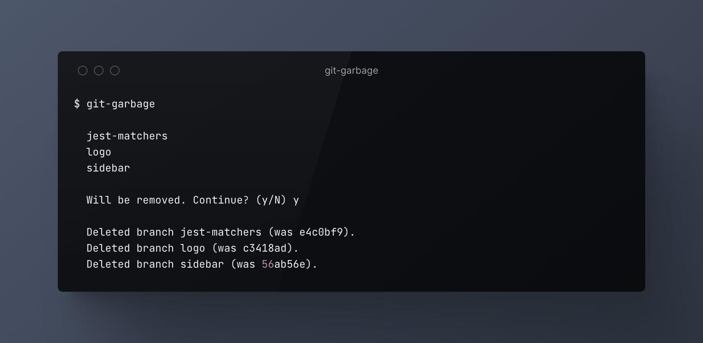

<p align="center">
  <br>
  
  <br>
</p>

> It deletes merged/squashed local git branches after deleting them on the remote repository.

## Install

```bash
npm install --global git-garbage
```

## Usage

<p align="center">
  <br>
  
  <br>
</p>

## Related 

* [git-dirty](https://github.com/Kikobeats/git-dirty#git-dirty) – Ensures the working directory is clean and that there are no unpulled changes.

## License

**miconfig** © [Kiko Beats](https://kikobeats.com), released under the [MIT](https://github.com/Kikobeats/git-garbage/blob/master/LICENSE.md) License. Logo by [Absurd Design](https://absurd.design).<br>

Authored and maintained by [Kiko Beats](https://kikobeats.com) with help from [contributors](https://github.com/Kikobeats/miconfig/contributors).

> [kikobeats.com](https://kikobeats.com) · GitHub [Kiko Beats](https://github.com/Kikobeats) · X [@Kikobeats](https://x.com/Kikobeats)
